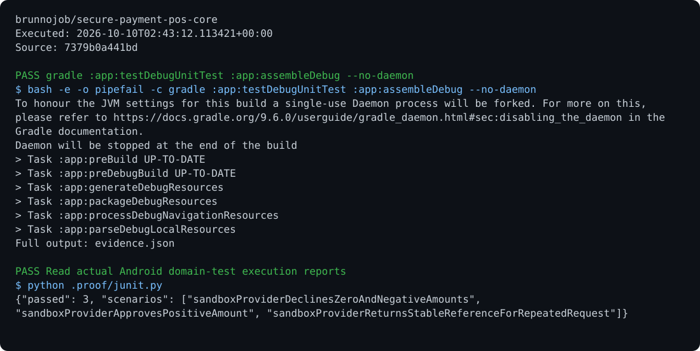

# POS Core

An Android application for catalog management, stock, received cash sales, Keystore-signed events, and queued synchronization.

## Run

Requirements: Android SDK, Kotlin, and Jetpack Compose.

```sh
gradle :app:testDebugUnitTest :app:assembleDebug
```

## Behavior

The operator creates products and confirms receipt of payment before recording a sale. Prices come from the persisted catalog; reservations and events use Room transactions. Provider rejections release reserved stock. Card and Pix payments require a real implementation of `PaymentProvider`. The archive API does not verify the local signature.

## Optional report archive

Use the [shared operations archive client](https://github.com/brunnojob/vercel-home-telemetry-api/tree/main/cloud) to queue `result.json` under project `secure-payment-pos-core`. The client uses `BRUNNODEV_ACCESS_TOKEN` and retains unacknowledged reports locally.

## License

Original source and documentation are MIT licensed; see [LICENSE](LICENSE). Third-party dependencies and media retain their respective terms. Maintained by [Brunno Dev](https://brunnodev.store).

## Implementation update

The Kotlin archive transport validates HTTPS destinations, token characters, idempotency keys, event kinds and payload sizes. A queue item is confirmed only when the receipt contains `persisted: true` and the matching client key.

Contribution trailer: `Co-authored-by: nyctophile <329826984+ineedfoundmyway@users.noreply.github.com>`.

## Execution proof

[](https://github.com/brunnojob/secure-payment-pos-core/actions/workflows/proof.yml)



[Verified run](https://github.com/brunnojob/secure-payment-pos-core/actions/runs/38017470486) · [Execution report](docs/proof/evidence.json)

Run `python .proof/record.py` after installing the prerequisites above. The scenarios execute repository code and verify exit codes and expected output. CI publishes `execution-proof` with the transcript, input fingerprints and source commit. The downloadable report identifies the exact tested version; the workflow badge tracks the latest run.
